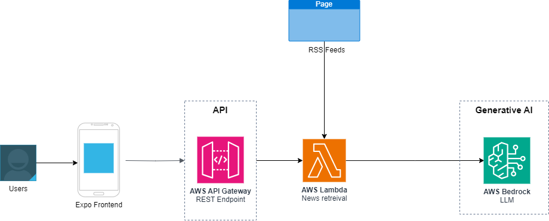

# knowUBC
This project was developed during the Internal CIC Hackathon. knowUBC is a mobile app that delivers UBC-specific news updates to users based on their selected categories. The app sends notifications to keep users informed about the topics they care about. This project focused on personalized news delivery to enhance the user experience.

| Index                                               | Description                                             |
| :-------------------------------------------------- | :------------------------------------------------------ |
| [High Level Architecture](#High-Level-Architecture) | High level overview illustrating component interactions |
| [Deployment](#Deployment-Guide)                     | How to deploy the project                               |
| [User Guide](#User-Guide)                           | The working solution                                    |
| [Directories](#Directories)                         | General project directory structure                     |
| [Changelog](#Changelog)                             | Any changes post publish                                |
| [Credits](#Credits)                                 | Meet the team behind the solution                       |
| [License](#License)                                 | License details                                         |

# High Level Architecture

The following architecture diagram illustrates the various AWS components utliized to deliver the solution. For an in-depth explanation of the frontend and backend stacks, refer to the [Architecture Deep Dive](docs/architecture_diagram_knowUBC.png).



# Deployment Guide

To deploy this solution, please follow the steps laid out in the [Deployment Guide](docs/DeploymentGuide.md)

# User Guide

For instructions on how to navigate the web app interface, refer to the [Web App User Guide](docs/UserGuide.md).

# Directories
```text
.                 
├── docs/
├── cdk
│   ├── bin
│   ├── lambda
│   ├── lib
│   ├── test                      
├── knowUBC/                   
│   ├── app/                 
│   ├── assets/                                      
└── README.md                   
```
# Directory Descriptions

- **docs/**: Contains documentation for the application.

- **frontend/**: Contains the user interface of the application.
  - **app/**: contains the frontend code of the application
  - **assets/**: Source files for the frontend application.

- **cdk/**: Contains the deployment code for the app's AWS infrastructure
  - /bin: Contains the instantiation of CDK stack
  - /lambda: Contains the lambda functions for the project
  - /lib: Contains the deployment code for all infrastructure stacks

- **README.md**: The main README file for the project.

  
# Changelog
N/A

# Credits

This application was architected and developed by Khushi Narang, Sean Woo, and Amy Cao during the UBC Cloud Innovation Centre's internal hackathon.

# License

This project is distributed under the [MIT License](LICENSE).

